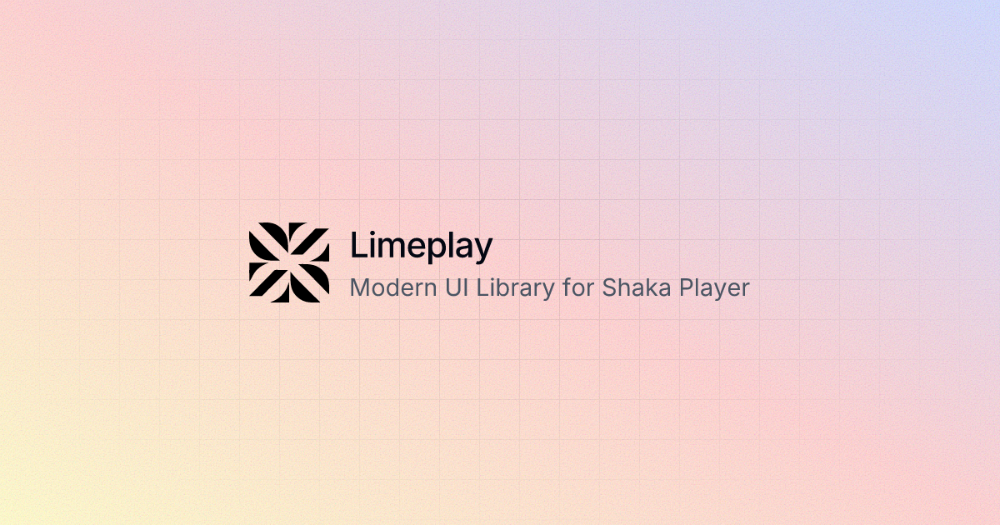

# Limeplay - Modern UI Library for Video Players

🔰 [@shadcn](https://ui.shadcn.com/docs/cli) CLI based UI library for building video player in React. Uses [@shaka-player](https://github.com/shaka-project/shaka-player) as the playback engine. Accessible and customizable components & hooks that you can copy and paste into your apps.

🏗️ Checkout [Blocks](https://limeplay.winoffrg.dev/blocks) for cooked examples.

## Documentation

Visit https://limeplay.winoffrg.dev/docs/quick-start to view the documentation.

Discussion and ideas on our [Discord Server](https://discord.gg/ZjXFzqmqjn)

## License

MIT © [WINOFFRG](https://github.com/winoffrg)
