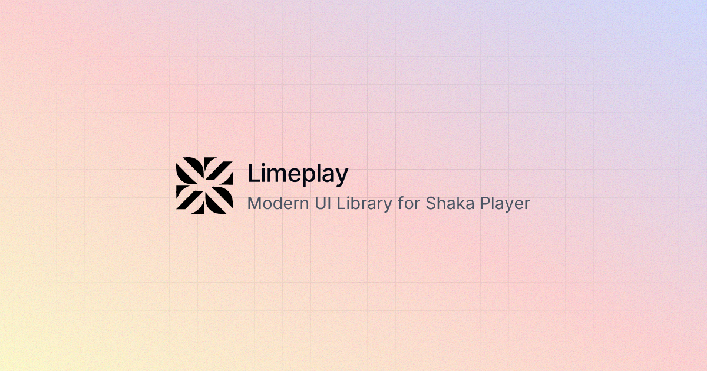
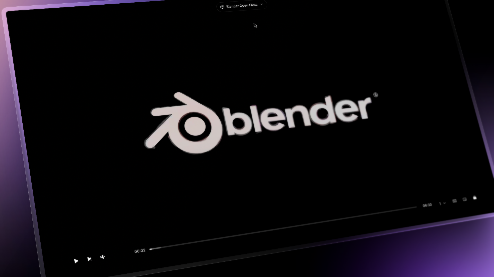

# Limeplay



Copy-paste media player components for React. Limeplay follows the shadcn/ui model: install a block, get the files in your app, and customize them like code you wrote yourself.

Built on Shaka Player for HLS, DASH, adaptive bitrate, and DRM-capable playback.

[Documentation](https://limeplay.winoffrg.dev/docs/quick-start) · [Blocks](https://limeplay.winoffrg.dev/blocks/video-player) · [Discord](https://discord.gg/ZjXFzqmqjn) · [Development](./DEVELOPMENT.md)

## Install

Start with a React project that already has shadcn/ui initialized.

```bash
npx shadcn@latest init
```

Add the video player block:

```bash
npx shadcn add @limeplay/video-player
```

Use it anywhere in your app:

```tsx
import { VideoPlayer } from "@/components/limeplay/video-player/components/media-player"

export function Player() {
  return (
    <VideoPlayer source="https://storage.googleapis.com/shaka-demo-assets/angel-one/dash.mpd" />
  )
}
```

> [!TIP]
> You can find more blocks in [Limeplay Blocks](https://limeplay.winoffrg.dev/blocks/video-player) showcase.



## Goals

1. Ship production-grade media players without rebuilding the hard parts. Limeplay gives you Netflix, YouTube, and Spotify-style interaction patterns with real playback behavior, not static UI.
2. Cover the details users notice: resilient error states, accessible controls, keyboard navigation, responsive layouts, browser support, and modern interaction states.
3. Keep ownership of the UI. Limeplay handles player logic, state, events, playlists, and media controls while the components stay fully editable in your app.
4. Build on a serious playback engine. Shaka Player brings HLS, DASH, live streaming, DRM-capable playback, adaptive bitrate, and more.

For custom layouts, feature hooks, and API references, start with the [quick start docs](https://limeplay.winoffrg.dev/docs/quick-start).

## License

MIT © [WINOFFRG](https://github.com/winoffrg)

[](https://star-history.com/#winoffrg/limeplay&Date)
