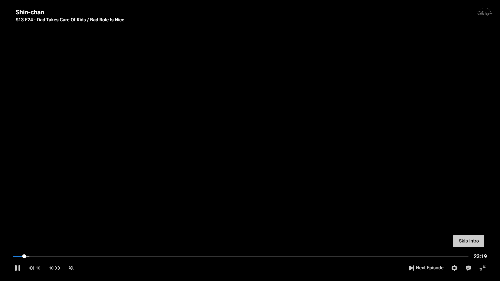
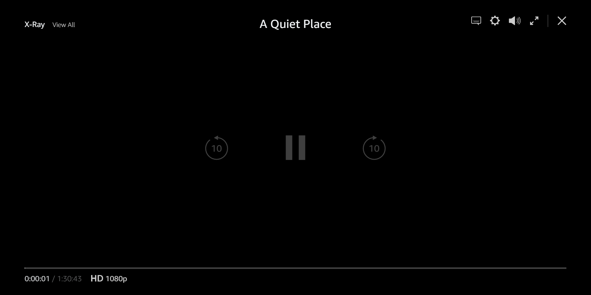
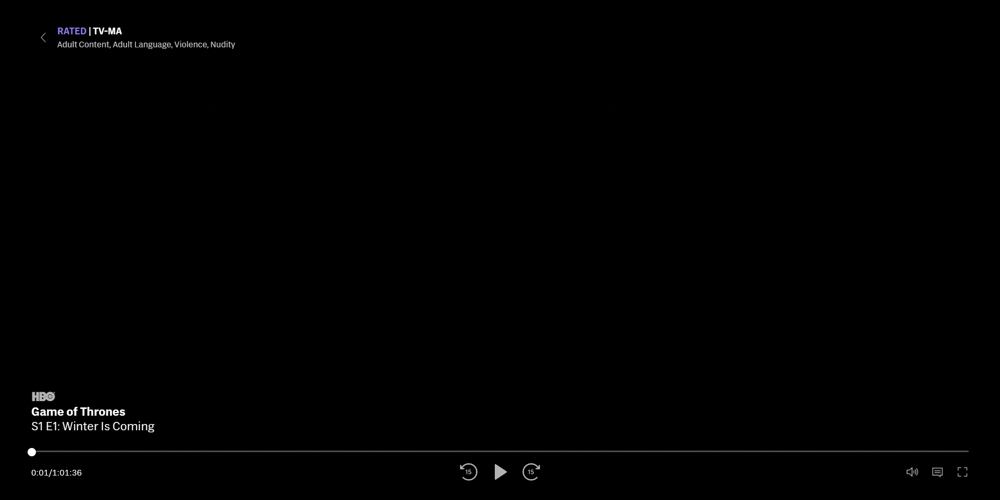

<h1 align="center">Limetree Player</h1>
<h2 align="center">
  An open source UI Library built on top of React for <a href="https://github.com/shaka-project/shaka-player">Shaka Player</a>.
</h2>

**Motivation:** Shaka Player officially provides a great production ready UI Library built on Vanilla JS which has great optimization in terms on both memory and performance, It serves its best in all the aspects like Localization, Accessibility, Customization, etc. However, The UI doesn't meet the modern design standard for the obvious reasons. To make it more scalable, maintainable, customisable and make the best use of power of React, this library is in development.

### 💎 Contribute: This project is in its early stage of development. Contributions, Suggestions are welcomed.

diff b/w useSate and useRef => one line => state change pe no component rerender using useRef

Sequencing

1. Parsing the server response and storing it in the state.
2. Features
   1. Video Playback
      1. Prerolls
      2. Fallbacks
      3. DRM
      4. Seekbar + Timings
      5. Chapters (Demo)
      6.
   2. Ads
   3. Timed Buttons
      1. Skip Intro
      2. Skip Credits
   4. Thumbnails
   5. Captions
   6. Audio Tracks
   7. Video Quality
   8. Meta Data
      1. Title
      2. Description
      3. Age / Ratings
      4. Badges
   9. Shelf - Up Next
   10. Player Status
       1. loading
       2. error
       3. fetching
       4. ...
   11. Discovery
       1. Prime Video like
   12. Register Listerners for Content Update
   13.

Design Analysis, Research, Features

## 1. Hulu

## 2. Hotstar

## 3. Prime Video

## 4. HBO Max

